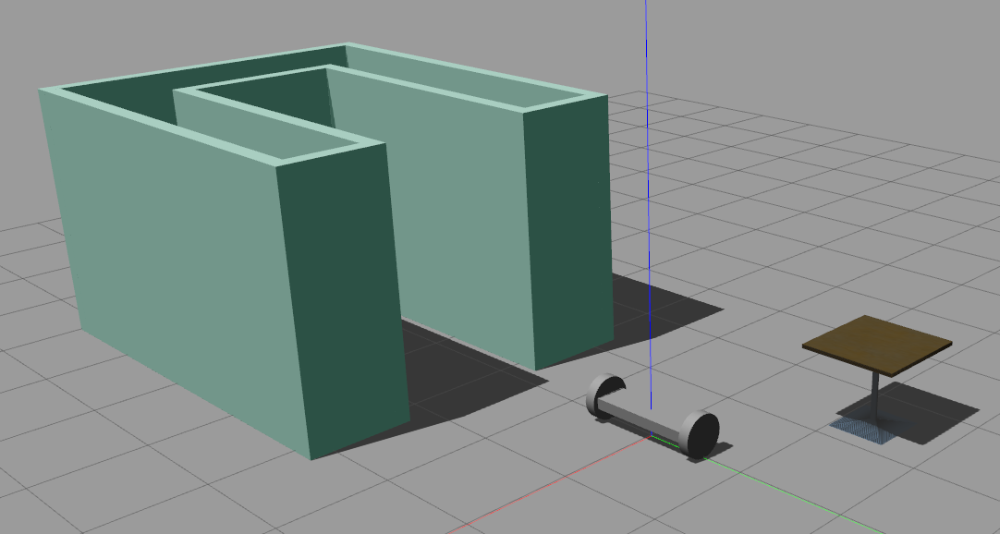

# Build My World
The aim of the project is to create a Gazebo world with 2 wheeled robot and building model. And interact with Gazebo by writing C++ plugin. 

<p align="center">
  
  <br>Gazebo World
</p>

## How to use
```sh
cd RoboND_P1_Build_My_World/world/
gazebo myworld
```
